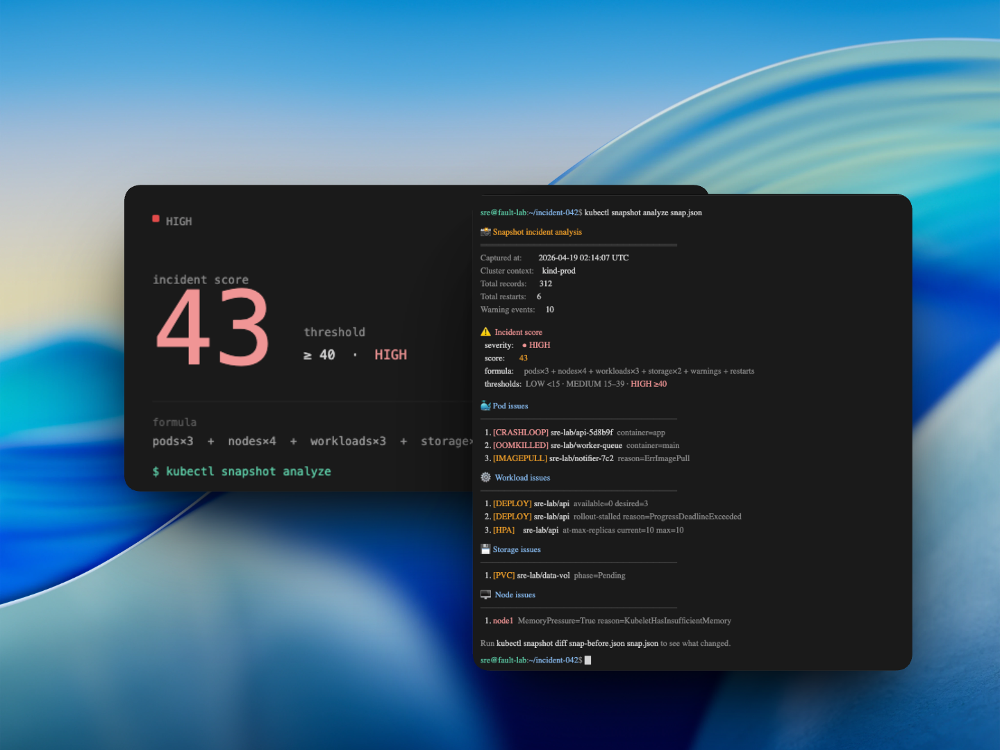

```
  _          _               _   _                                              _           _
 | | ___   _| |__   ___  ___| |_| |   ___ _ __   __ _ _ __  ___| |__   ___ | |_
 | |/ / | | | '_ \ / _ \/ __| __| |  / __| '_ \ / _` | '_ \/ __| '_ \ / _ \| __|
 |   <| |_| | |_) |  __/ (__| |_| |  \__ \ | | | (_| | |_) \__ \ | | | (_) | |_
 |_|\_\\__,_|_.__/ \___|\___|\__|_|  |___/_| |_|\__,_| .__/|___/_| |_|\___/ \__|
                                                       |_|

              📸  point-in-time Kubernetes cluster forensics
```

[](https://github.com/whtssub/kubectl-snapshot/actions)
[](https://go.dev/)
[](LICENSE)
[](https://github.com/whtssub/kubectl-snapshot/releases)



A `kubectl` plugin that captures point-in-time snapshots of Kubernetes cluster state and analyzes them for post-incident review. Freeze what your cluster looked like, diff two snapshots to see what changed, or run a scored incident analysis to surface pod failures, node pressure, deployment stalls, and storage problems — all from a single portable JSON file.

---

## What it does

| Command | Description |
|---------|-------------|
| `capture` | Serialises 24 resource types into a portable JSON bundle |
| `diff` | Compares two bundles — shows what was added, removed, or changed |
| `analyze` | Inspects a bundle for incident signals with a severity-scored report |
| `history` | Lists previously captured snapshots from the local index |
| `trend` | Compares pod counts, restarts, and warning events across N snapshots |
| `completion` | Generates shell completion scripts for bash / zsh / fish / PowerShell |

---

## Install

### From a release binary (recommended)

Download the archive for your platform from the [Releases](https://github.com/whtssub/kubectl-snapshot/releases) page, extract it, and place the binary on your `PATH`.

```bash
# macOS arm64
curl -L https://github.com/whtssub/kubectl-snapshot/releases/latest/download/kubectl-snapshot_Darwin_arm64.tar.gz | tar xz
mv kubectl-snapshot ~/.local/bin/

# Linux amd64
curl -L https://github.com/whtssub/kubectl-snapshot/releases/latest/download/kubectl-snapshot_Linux_x86_64.tar.gz | tar xz
mv kubectl-snapshot ~/.local/bin/
```

`kubectl` discovers it automatically because the binary is named `kubectl-snapshot`.

#### Verifying checksums

Every release ships a `checksums.txt` file. Verify your download before using it:

```bash
# Download the binary and checksums
curl -LO https://github.com/whtssub/kubectl-snapshot/releases/latest/download/kubectl-snapshot_Linux_x86_64.tar.gz
curl -LO https://github.com/whtssub/kubectl-snapshot/releases/latest/download/checksums.txt

# Verify (sha256sum on Linux, shasum -a 256 on macOS)
sha256sum --check --ignore-missing checksums.txt
# or on macOS:
shasum -a 256 --check --ignore-missing checksums.txt
```

### From source (Go 1.22+)

```bash
go install github.com/whtssub/kubectl-snapshot/cmd/kubectl-snapshot@latest
```

### Shell completion

Enable tab-completion for your shell after installing:

```bash
# bash (~/.bashrc)
source <(kubectl snapshot completion bash)

# zsh (~/.zshrc)
source <(kubectl snapshot completion zsh)

# fish (~/.config/fish/config.fish)
kubectl snapshot completion fish | source

# PowerShell ($PROFILE)
kubectl snapshot completion powershell | Out-String | Invoke-Expression
```

---

## Usage

### Capture

```bash
# Full cluster (all namespaces, all resource types)
kubectl snapshot capture -o snap.json

# Single namespace
kubectl snapshot capture -n production -o snap.json

# Specific resource types (short names, plural names, or group/version/resource)
kubectl snapshot capture --resources pods,deploy,pvc -o snap.json
kubectl snapshot capture --resources myapp.io/v1/widgets -o snap.json

# Scope to a label selector
kubectl snapshot capture --selector app=frontend -o snap-frontend.json
kubectl snapshot capture -l env=prod -o snap-prod.json

# Compressed output (~75% smaller for large clusters)
kubectl snapshot capture --compress gzip -o snap.json.gz
```

### Diff

```bash
kubectl snapshot diff before.json after.json
kubectl snapshot diff before.json after.json --max-items 30
```

```
Snapshot Diff Report
--------------------
Before records: 51
After records:  84
Added:          33
Removed:        0
Changed:        1
Net delta:      +33

📋 ADDED RESOURCES
─────────────────────────────────
   1. deployments default/api-server
   2. persistentvolumeclaims default/data-pvc
   3. pods default/worker-7d9f
  ... and 30 more

📋 REMOVED RESOURCES
─────────────────────────────────
  ✓ none

📋 CHANGED RESOURCES
─────────────────────────────────
   1. deployments default/frontend
```

### Analyze

```bash
kubectl snapshot analyze snap.json
kubectl snapshot analyze snap.json --severity-threshold medium
kubectl snapshot analyze snap.json --no-resource-mix --no-warning-events

# Restrict to one namespace (nodes and other cluster-scoped resources still included)
kubectl snapshot analyze snap.json --namespace production

# Machine-readable output for piping into alerting tools
kubectl snapshot analyze snap.json --output json | jq '.incident'

# SARIF output for GitHub Code Scanning
kubectl snapshot analyze snap.json --output sarif > results.sarif
```

```
📸 Snapshot Incident Analysis
═════════════════════════════════
Captured at:        2026-04-17 10:00:00 UTC
Cluster context:    kind-prod
Total records:      312
Total restarts:     6
Warning events:     10
Non-normal events:  0

⚠️ INCIDENT SCORE
- severity: 🔴 HIGH
- score:    43
- formula:  pods×3 + nodes×4 + workloads×3 + storage×2 + warnings + restarts (cap 50)
- thresholds: LOW <15 · MEDIUM 15–39 · HIGH ≥40

📦 RESOURCE MIX
  pods                         184
  events                        72
  deployments                   18
  replicasets                   18

🐳 POD ISSUES
─────────────────────────────────
   1. [CRASHLOOP] sre-lab/api-5d8b9f container=app msg="back-off restarting failed container"
   2. [OOMKILLED] sre-lab/worker container=main
   3. sre-lab/batch phase=Failed

⚙️  WORKLOAD ISSUES
─────────────────────────────────
   1. [DEPLOY] sre-lab/api available=0 desired=3
   2. [DEPLOY] sre-lab/api rollout-stalled reason=ProgressDeadlineExceeded
   3. [STS] sre-lab/postgres ready=1 desired=3
   4. [HPA] sre-lab/api at-max-replicas current=10 max=10
   5. [JOB] sre-lab/etl-pipeline failed reason=BackoffLimitExceeded
   6. [CRONJOB] sre-lab/nightly-report never-succeeded last-schedule=2026-04-17T10:00:00Z

💾 STORAGE ISSUES
─────────────────────────────────
   1. [PVC] sre-lab/data-vol phase=Pending
   2. [PV] pv-archive phase=Released

🖥️  NODE ISSUES
─────────────────────────────────
   1. node1 MemoryPressure=True reason=KubeletHasInsufficientMemory

⚠️  WARNING EVENTS
─────────────────────────────────
   1. sre-lab/api.1a2b3c reason=BackOff msg="back-off restarting failed container app..."
```

### History

Every `capture` automatically adds an entry to `~/.kubectl-snapshot/history.json`.

```bash
# List all captured snapshots (newest first)
kubectl snapshot history

# Use a custom index path
kubectl snapshot history --index /shared/snapshots/history.json
```

### Trend

```bash
# Compare two specific snapshots
kubectl snapshot trend before.json after.json

# Compare the last 5 captures from the history index
kubectl snapshot trend --last 5
```

> **Color output** is enabled by default. Set `NO_COLOR=1` to disable.

---

## Captured resource types

| Category | Resources |
|----------|-----------|
| Core workloads | pods, nodes, events |
| App workloads | deployments, replicasets, statefulsets, daemonsets, jobs, cronjobs |
| Networking | services, endpoints, ingresses, networkpolicies |
| Storage | persistentvolumeclaims, persistentvolumes |
| Config | configmaps *, secrets * |
| RBAC | serviceaccounts, roles, rolebindings, clusterroles, clusterrolebindings |
| Autoscaling | horizontalpodautoscalers, verticalpodautoscalers † |

\* `.data` and `.binaryData` are **never written to disk** — only metadata is captured.  
† Silently skipped on clusters without the VPA operator.

---

## Understanding severity

The `analyze` command scores a snapshot using:

```
score = pods×3 + nodes×4 + workloads×3 + storage×2 + warnings + restarts
```

Restart count is **capped at 50** before scoring — a pod with 1 000 restarts won't inflate the score to noise. The raw count is always shown in the header.

| Severity | Score | `--severity-threshold` effect |
|----------|-------|-------------------------------|
| 🟢 LOW | < 15 | No filtering; all sections shown at full `--max-items` |
| 🟡 MEDIUM | 15 – 39 | Suppresses LOW results; up to 50 items per section |
| 🔴 HIGH | ≥ 40 | Suppresses LOW + MEDIUM results; up to 10 items per section |

**Job-owned pods** are excluded from pod issue analysis — they run to completion by design. The Jobs and CronJobs themselves are analyzed under **WORKLOAD ISSUES**:

| Signal | Condition |
|--------|-----------|
| `[JOB] <name> suspended` | `spec.suspend: true` |
| `[JOB] <name> failed reason=<r>` | `status.conditions[Failed=True]` |
| `[JOB] <name> failed-attempts=N` | `status.failed > 0`, no `Complete` condition |
| `[CRONJOB] <name> suspended` | `spec.suspend: true` |
| `[CRONJOB] <name> never-succeeded` | scheduled at least once but `lastSuccessfulTime` is absent |

---

## Supported flags

| Command | Flag | Description |
|---------|------|-------------|
| `capture` | `--output`, `-o` | Output file path (required) |
| `capture` | `--namespace`, `-n` | Limit capture to one namespace (default: all) |
| `capture` | `--selector`, `-l` | Label selector to filter resources (e.g. `app=frontend`) |
| `capture` | `--resources` | Comma-separated resource types to capture (default: all) |
| `capture` | `--compress` | Compress output: `gzip` |
| `capture` | `--kubeconfig` | Path to kubeconfig file |
| `capture` | `--no-index` | Skip adding this snapshot to the local history index |
| `capture` | `--index` | Custom history index path (default: `~/.kubectl-snapshot/history.json`) |
| `diff` | `--max-items` | Max entries per section (default: 15) |
| `analyze` | `--max-items` | Max entries per section (default: 15) |
| `analyze` | `--namespace`, `-n` | Restrict analysis to one namespace (cluster-scoped records always included) |
| `analyze` | `--severity-threshold` | Suppress output below this level: `low`, `medium`, `high` |
| `analyze` | `--no-resource-mix` | Hide resource mix section |
| `analyze` | `--no-warning-events` | Hide warning events section |
| `analyze` | `--output` | Output format: `text` (default), `json`, or `sarif` |
| `analyze` | `--since` | Only include warning events from the last duration (e.g. `1h`, `30m`) |
| `history` | `--index` | Custom history index path (default: `~/.kubectl-snapshot/history.json`) |
| `trend` | `--last` | Number of recent history snapshots to compare (default: 5) |
| `trend` | `--index` | Custom history index path (default: `~/.kubectl-snapshot/history.json`) |
| `completion` | _(positional)_ | Shell name: `bash`, `zsh`, `fish`, or `powershell` |

---

## Local development

### Prerequisites

- Go 1.22+
- [kind](https://kind.sigs.k8s.io/) (for integration testing)
- Docker Desktop (for kind)

### Build

```bash
make build
make install-plugin   # copies binary to ~/.local/bin
make plugin-check     # verifies kubectl discovers it
```

### Run the SRE fault-lab

Spins up a local Kind cluster and injects real failure scenarios:

```bash
make kind-up
make capture-before
make scenario-all      # OOMKill, CrashLoop, ImagePullBackOff, Pending, DiskPressure
make capture-after
make diff
make analyze
make kind-down
```

Included scenarios (namespace `sre-lab`):

| Scenario | What it demonstrates |
|----------|---------------------|
| `oomkill-demo` | OOMKilled container, `[OOMKILLED]` in analyze output |
| `crashloop-demo` | CrashLoopBackOff, `[CRASHLOOP]` in analyze output |
| `imagepullbackoff-demo` | ErrImagePull / ImagePullBackOff waiting state |
| `pending-unschedulable-demo` | Insufficient CPU/memory, pod stuck Pending |
| `diskpressure-best-effort` | Best-effort DiskPressure trigger on node |
| `completed-jobs` | Completed Job + CronJob — verifies zero false positives in `analyze` |

### Run tests

```bash
make test       # full suite with race detector
make coverage   # coverage report (text summary)
make fmt        # format all Go source files
make lint       # go vet
```

Or directly without Make:

```bash
go test -race ./...
```

---

## License

Apache 2.0 — see [LICENSE](LICENSE).
